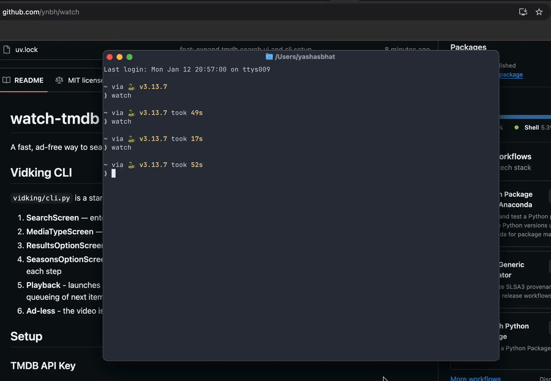

# watch-tmdb

Search and play TMDB content from a fast, keyboard-first terminal UI.

## Demo



## What it does

- Textual TUI search over movies + TV (TMDB multi-search)
- Filter results (all / movies / TV) and page through matches
- Drill into seasons and episodes for TV shows
- Launch a chromeless Chrome window with a sandboxed iframe player

## Requirements

- Python 3.13+
- Google Chrome (or Chromium) plus a compatible ChromeDriver for Selenium
- TMDB API Read Access Token: <https://developer.themoviedb.org/docs/getting-started>

## Setup

Option 1: save your TMDB token via the CLI (stored at `~/.config/watch-cli/config.json`):

```bash
uv run watch set-env <your read access token>
```

Option 2: create a `.env` file in the project root:

`TMDB_READ_ACCESS_TOKEN=<your read access token>`

## Run

From the project root:

```bash
uv run watch
```

Install with pipx from git:

```bash
pipx install git+https://github.com/ynbh/watch
watch # you want to set the token first, but it will prompt you if you dont :)
```

## Key bindings

- `Enter`: select highlighted option
- `Esc`: go back (or quit from the home screen)
- `n` / `p`: next / previous results page
- `a` / `m` / `t`: filter all / movies / TV
